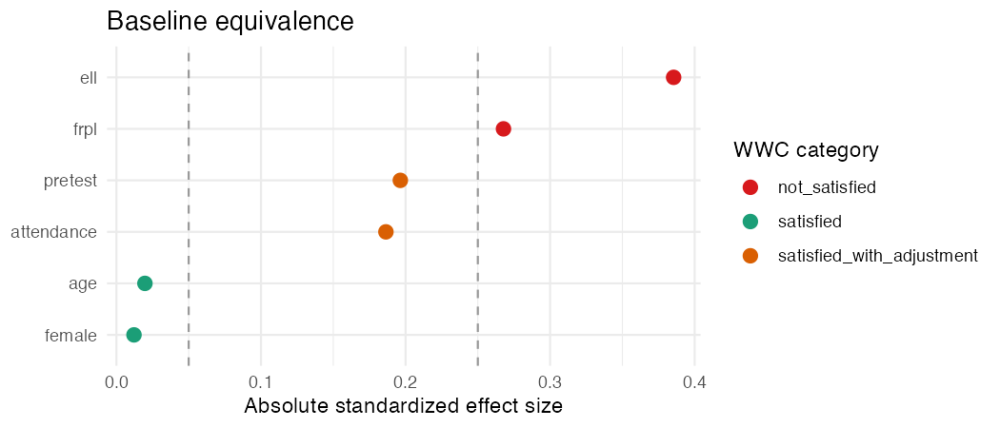

For a long time the baseline table was the part of a report I did last, fast, and
a little resentfully. Throat clearing before the real analysis, was how I thought
about it. Get it out of the way, get to the effect.

I had it exactly backwards about which part was the real analysis.

By the time you're estimating a program effect, you've already placed the bet that
matters: that the two groups were comparable to begin with. If they weren't,
you're not measuring the program. You're measuring the head start. No model
downstream fixes that, and reviewers, funders, and the What Works Clearinghouse
all know exactly where to look.

## The question it's actually answering

Plain version: before the program started, were these groups similar enough that I
can pin later differences on the program instead of on who was in each group?

Notice what that is *not*. It is not "is the baseline difference statistically
significant?" That's the reflex, run a t test on the pretest, see p > .05, declare
the groups fine, move on. But significance is the wrong tool here, for a reason
that has nothing to do with the program. With a big sample, a trivial difference
turns "significant." With a small one, a real gap sails through as "not
significant." A p value is mostly telling you about your sample size. Equivalence
is a question about *size of the gap*. Different question.

## What the WWC asks for instead

For each covariate you report a standardized mean difference (Hedges' g, which is
Cohen's d with a small sample correction), and you read it against two numbers:

| Hedges' g (absolute value) | Category | What it commits you to |
|---|---|---|
| `≤ 0.05` | Satisfied | Nothing. The groups are equivalent here. |
| `0.05`–`0.25` | Satisfied *with adjustment* | Fine **only if** you adjust for this covariate in the impact model. |
| `> 0.25` | Not satisfied | This one can't establish equivalence, and adjustment won't save it. |

The whole framework is those two numbers, 0.05 and 0.25, applied honestly. The
arithmetic isn't the hard part. Remembering what each category obligates you to do
later is.

## Doing it without a spreadsheet

Here it is on a simulated tutoring evaluation, 400 students, data I bundled into
[`baselinr`](https://github.com/zl1212-ship-it/baselinr) just for this. One call,
whole table:

```r
library(baselinr)
data(tutoring)

baseline_equivalence(
  tutoring, treatment = "treat",
  covariates = c("pretest", "attendance", "age", "female", "frpl", "ell")
)
```

| Covariate | Type | Mean (T) | Mean (C) | Effect size | WWC category |
|---|---|---:|---:|---:|---|
| pretest | continuous | 52.15 | 50.10 | 0.196 | satisfied_with_adjustment |
| attendance | continuous | 0.927 | 0.918 | 0.186 | satisfied_with_adjustment |
| age | continuous | 10.04 | 10.03 | 0.020 | satisfied |
| female | binary | 0.530 | 0.525 | 0.012 | satisfied |
| frpl | binary | 0.555 | 0.445 | 0.268 | **not_satisfied** |
| ell | binary | 0.250 | 0.150 | 0.385 | **not_satisfied** |

Continuous covariates get Hedges' g; the binary ones get the Cox index, handled
for you. And honestly the plot is where it clicks:

```r
love_plot(baseline_equivalence(tutoring, "treat",
          covariates = c("pretest", "attendance", "age", "female", "frpl", "ell")))
```



Age and sex are equivalent, nothing to do. Pretest and attendance sit in the
middle band, so you can proceed but you owe the model an adjustment. And then
poverty status and language status blow past 0.25, which means the groups differ
on two things adjustment can't fix. That last pair is something you'd want to know
*before* you ever report an effect, not after a reviewer finds it.

## The part that quietly leaks credibility

"Satisfied with adjustment" is not a passing grade. It's a promise. It says: these
groups are close enough, *as long as* I actually control for this covariate in the
impact model. And it is genuinely common to see a baseline table that files a
covariate under "satisfied with adjustment" and then an impact model that never
adjusts for it. The table says one thing, the model does another, and a careful
reader catches it instantly. If a covariate lands in the middle band, it has to
show up in the model. Every time.

Treat the baseline table like the load bearing wall it is, not the trim you tack
on at the end. Get it right and everything downstream has something solid to stand
on. Get it wrong and your fanciest model is just measuring the head start.

---

*I build [`baselinr`](https://github.com/zl1212-ship-it/baselinr), a small R
package that produces these tables, and a cohort course on credible evaluation and
measurement in education. [subscribe via RSS](https://zl1212-ship-it.github.io/education-methods/index.xml) to follow along.*
