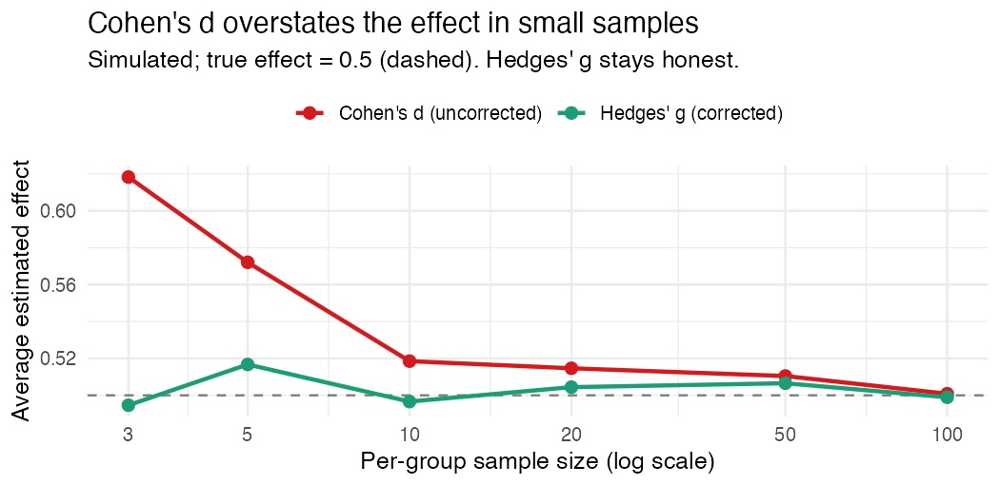

"We found a significant effect." I have a mild allergic reaction to that sentence
and I've accepted it's permanent.

It's not that it's wrong. It's that it tells you almost nothing. Significant says
*we detected something*. It says nothing about *how big*, which is the only thing
a school board or a funder or the What Works Clearinghouse actually wants to know.
That's what an effect size is for, and in education that means a standardized mean
difference, with a couple of small decisions baked in that quietly move the number.

## The thing itself

Strip it down: take the gap between the two group means, divide by a standard
deviation. Now the effect is in standard deviation units, so a reading program and
a math program can sit on the same ruler. Two studies with the same raw point gain
can land at very different standardized effects, because the spread of scores
differs. Which is the point. It's also where the choices start to matter.

## Cohen's d vs. Hedges' g

Cohen's d puts the pooled within group SD in that denominator. Fine, except it has
a known flaw: in small samples it's biased *upward*. It overstates. And education
studies are small constantly, a few classrooms, a handful of schools, so this is
not a hypothetical.

Hedges' g is just Cohen's d times a small sample correction. When the sample is
big, the correction is basically 1 and the two agree. When it's small, the
correction pulls the estimate back toward the truth. WWC reports g for exactly this
reason, and once you see the size of the bias you stop arguing about it.

Here's the bias, simulated. True standardized effect is 0.5. I draw a pile of
small studies and average each estimator:

| Per group n | Cohen's d | Hedges' g |
|---:|---:|---:|
| 3 | **0.618** | 0.495 |
| 5 | 0.572 | 0.517 |
| 10 | 0.519 | 0.497 |
| 100 | 0.501 | 0.499 |

Three per group and uncorrected d averages 0.618, a 24% overstatement of an effect
that is really 0.5. Hedges' g sits at 0.495. By a hundred per group they shake
hands. Small education studies live on the left edge of that plot, which is
precisely where skipping the correction costs you.

## The little decisions people get wrong

Which SD goes in the denominator. Pooled (both groups) is the usual choice and
what the WWC convention assumes. control group only is sometimes defensible, but if
you pick it without saying so, your effect size isn't comparable to anyone else's.
State your denominator.

Treating a small sample d as if it were unbiased. If n is small and you skipped the
correction, your number is inflated. Use g.

And comparing effect sizes across studies that standardized differently. A 0.30 on
a narrow, homogeneous sample is not the same animal as a 0.30 on a broad one.
Effect sizes are only comparable when the rulers are.

## Reporting it like you mean it

Give the effect size with an interval, not a lonely point estimate; "g = 0.8" with
no uncertainty begs to be over trusted. Tie the number to a decision, because
"significant" and "meaningful" are different words. And say your choices out loud
so the number can be checked.

A standardized mean difference is a tiny calculation carrying a big claim. Get the
denominator and the correction right, attach honest uncertainty, translate it into
something a human can act on. Skip those and "significant" becomes a word that
hides more than it tells.

---

*I build [`baselinr`](https://github.com/zl1212-ship-it/baselinr), a small R
package for WWC aligned baseline equivalence and effect sizes, and a cohort course
on credible evaluation and measurement in education. [subscribe via RSS](https://zl1212-ship-it.github.io/education-methods/index.xml) to follow along.*
