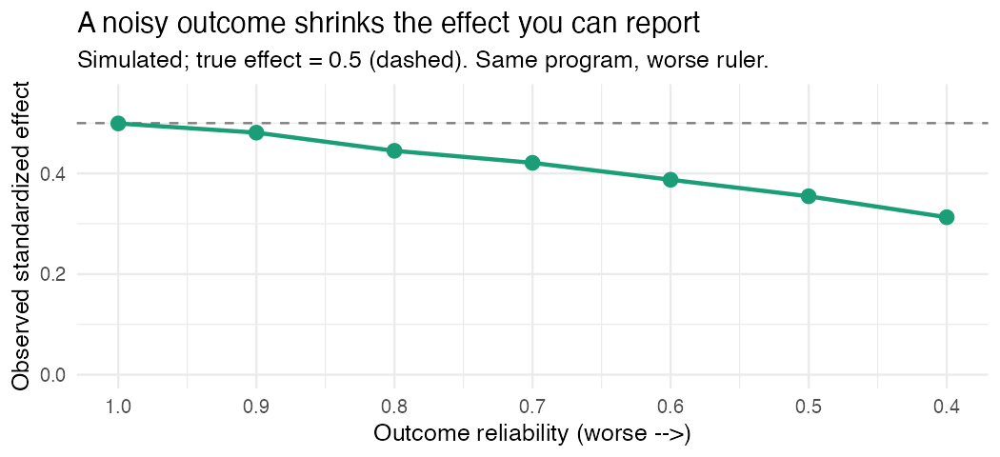

The saddest sentence in program evaluation is "the program didn't work," when
what actually happened was "we measured it with a broken ruler." Those two get
mixed up constantly, and the second one wears the first one's clothes.

Here's the part that stings: teams will spend months on the design, the
randomization, the comparison group, the matching, and then about ten minutes on
the thing they actually measure. And then they're surprised by a null result.

## What a noisy outcome quietly does

Random measurement error in your outcome doesn't just scatter the points around a
bit. It inflates the variance of the outcome, which widens your standard errors,
which costs you power. And because the standard deviation in your effect-size
denominator just got bigger, the standardized effect you can report *shrinks*. You
can run a flawless design on a bad measure and find nothing, not because the
program failed, but because your ruler was made of rubber.

So before the model, check the ruler.

## Reliability: what one number hides

Reliability usually shows up as a single coefficient, Cronbach's alpha most of the
time, and gets a nod on the way to the regression. But that one number is hiding
things. Alpha climbs with the number of items, not only their quality, so a long
mediocre scale can post a comfortable one. It leans on the items being roughly
interchangeable, and when they aren't it can mislead in either direction (which is
why a lot of measurement people reach for McDonald's omega instead). And a high
alpha is not proof your items measure one thing.

A "respectable" reliability can also just be too low for *your* claim. Detecting a
small effect on a moderately unreliable outcome can demand far more sample than you
have. The reliability you need is a function of the effect you're chasing, not a
fixed bar you clear once and forget.

## Validity, briefly

Reliability is consistency. Validity is aboutness. A bathroom scale that reads
three pounds heavy every single time is perfectly reliable and perfectly wrong. For
an outcome, the evidence worth showing is whether the items cover the construct,
whether the data back the dimensions you claim, and whether the measure relates to
things it should and not to things it shouldn't. You don't need all of it for every
study. You do need to stop claiming more than your evidence supports.

## A check you can actually run

Before you trust an outcome, look at it. On your own data, not invented numbers,
look at the item behavior and an internal-consistency estimate for each key
construct:

```r
# On YOUR data. Do not report invented coefficients.
# items <- your_data[, c("q1", "q2", "q3", "q4")]
# psych::alpha(items)       # internal consistency + item-level diagnostics
# psych::omega(items)       # model-based reliability
# psych::fa.parallel(items) # how many dimensions are actually in there?
```

Read the item-level output, not just the headline. An item that barely correlates
with the rest, or a "scale" that turns out to be two factors in a trench coat, will
tell you more than alpha ever does alone.

## Why this goes before the impact model

Because everything downstream inherits it. Here's the same point, simulated. The
program has a *real* effect, true standardized 0.5. The only thing I change is how
reliably the outcome is measured:

| Outcome reliability | Observed effect | Power |
|---:|---:|---:|
| 1.00 | 0.50 | 70% |
| 0.80 | 0.45 | 60% |
| 0.60 | 0.39 | 48% |
| 0.40 | 0.31 | 34% |



Same program. Same design. Same sample. Only the ruler gets noisier, and the effect
you'd report slides from 0.50 to 0.31 while your power to see *anything* falls from
70% to 34%. Half your ability to detect a real effect, gone, because the outcome
measure was weak.

Measurement isn't the boring prelude to the real analysis. On a bad measure, it
*is* the result. Check the ruler before you trust the measurement.

---

*I build [`baselinr`](https://github.com/zl1212-ship-it/baselinr) and a cohort
course on credible evaluation and measurement in education, where this is
basically a whole week. [subscribe via RSS](https://zl1212-ship-it.github.io/education-methods/index.xml) to follow along.*
