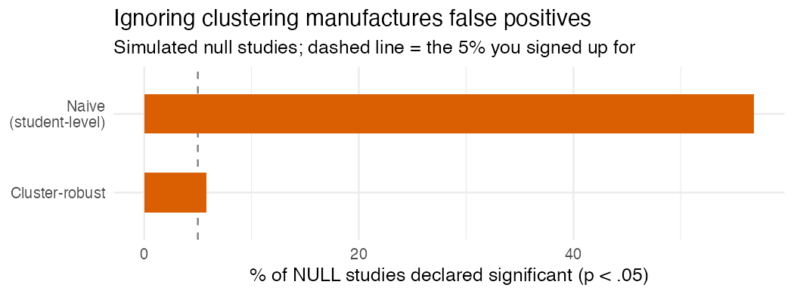

Sixty schools, three thousand students, and a p-value with more zeros after the
decimal than you have ever earned honestly. It feels amazing. I've had that little
rush, the one where you think *oh, this is going in the abstract.*

I'm sorry to tell you it's frequently a lie, and the lie is baked into the very
first thing you assumed: that you have three thousand independent pieces of
information.

You don't.

## Why "n = 3,000" is fiction

Kids in the same school resemble each other. Same teachers, same building, same
neighborhood, same everything. So each extra student from a school you've already
sampled tells you less than a brand-new, unrelated student would. Regression
assumes your rows are independent. When they're clustered and you shrug and run it
anyway, your standard errors come out too small, your test statistics too big, and
out the other end pours a parade of "significant" effects that are mostly just the
model fooling itself.

How much smaller depends on the intraclass correlation, the ICC, which is the
share of the variation that lives *between* schools rather than within them. A
little clustering barely dents you. A lot of it quietly guts your real sample size
down toward the number of *schools* rather than the number of students.

## The machinery, quickly

ICC measures how much students within a cluster move together. The design effect
turns that into how badly your naive standard errors lie. Cluster-robust standard
errors and multilevel models are the two standard fixes (robust SEs patch the
uncertainty; multilevel models patch it *and* let you study how schools differ).
And if you've only got a handful of clusters, even robust SEs get shaky, and you
reach for a wild cluster bootstrap.

## Watch it happen

This is my favorite part, because it's so stark. Sixty schools, fifty kids each, a
school-level treatment, and a true effect of exactly zero. The within-school
correlation gives an ICC around 0.26, a design effect of roughly 14, so those
3,000 students carry about as much information as 210.

One representative null study:

```r
m <- lm(y ~ treat, data = study)        # student-level, ignores clustering
sqrt(diag(vcov(m)))["treat"]                          # naive SE
sqrt(diag(sandwich::vcovCL(m, cluster = ~school)))["treat"]  # cluster-robust SE
```

| Standard error | SE | p-value |
|---|---:|---:|
| Naive (student-level) | 0.043 | **< 0.0001** |
| Cluster-robust (school) | 0.157 | **0.167** |

Same estimate, same data. The naive version is screaming significance. The honest
version shrugs, correctly, because there is nothing there.

And it's not one unlucky draw. Across 600 simulated null studies:



The naive analysis declares a significant effect in **57%** of studies where the
truth is *nothing*. Fifty-seven percent. The cluster-robust version sits at 6%,
right about the 5% you signed up for. If you ignore clustering, "p < .05" doesn't
mean what you think it means. It barely means anything.

## What to do

Cluster at the level treatment was actually assigned (rolled out by school? then
school, not student). Report the ICC so your reader knows how much this even
matters here. Watch out when you've only got a few clusters. And if you genuinely
care about how schools differ, not just correcting for it, go multilevel.

Before you celebrate a tiny p-value, just ask where the rows came from. In
education they're almost always nested, which means "n" is not the number of
students, and significance computed as if it were is significance you didn't earn.

---

*I build [`baselinr`](https://github.com/zl1212-ship-it/baselinr) and I'm building
a cohort course on running education evaluations you can actually trust.
[subscribe via RSS](https://zl1212-ship-it.github.io/education-methods/index.xml) to follow along.*
