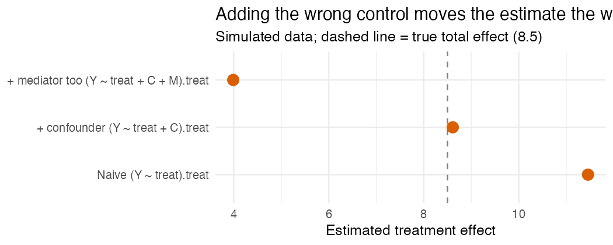

Okay so. A reviewer once told me to control for a variable. I added it, the
coefficient changed, and I took the change as proof the variable mattered.

It is not proof the variable mattered. It took me way longer than I'd like to
admit to get that.

Adding a control and watching the number jump feels productive. It feels careful.
But a number moving only tells you a number moved. It doesn't tell you whether you
got closer to the truth or further from it. That depends on what the variable
actually is, and "just throw in more controls" quietly lumps together three things
that behave nothing alike.

## Three reasons a variable is in your model

One: it's a **confounder**. Something that causes both who got treated *and* the
outcome. Pretest scores, if the higher-scoring kids were also more likely to get
the program. You want these in the model. Leaving them out is the thing everyone's
(rightly) scared of.

Two: it's a **mediator**. Something the treatment causes, which then moves the
outcome. It's part of how the program works. Control for it and you're literally
subtracting off a piece of the effect you came to measure.

Three: it's a **collider**. The weird one. It's a shared *consequence* of two
things, and it sits there harmlessly until you condition on it, at which point it
invents a correlation that was never real.

"Control for everything you can" treats all three the same. Two of them make your
answer worse.

## Just draw the arrows

This is less philosophical than it sounds. Sketch what causes what (a DAG, if we're
being formal). Then the rule is basically mechanical: block the paths that sneak in
*through* the treatment, and leave alone anything the treatment causes or anything
two variables jointly cause.

A reviewer saying "control for X" is making a guess about where X lives on that
picture. It's not a command. Go look at where it actually sits.

## The one that got me

Say you're evaluating a tutoring program and your outcome is test scores. Being
responsible, you decide to control for student motivation. Reasonable, except you
measured motivation *after* the program ran. Which means the program probably moved
it. So now motivation is downstream of the treatment, and controlling for it shaves
off exactly the part of the effect that went "kids got more into it, then did
better." You conclude tutoring barely did anything.

It did something. You just deleted the evidence. And it felt like diligence the
whole time, because, again, the coefficient moved.

## Watch it happen

I simulated this so it's not just me asserting things. True total effect of the
program: 8.5. There's a trait `C` that drives both treatment and the outcome (a
real confounder), and `M` is motivation measured after the program (a mediator).

```r
# Estimand: total effect of `treat` on `Y` (simulated; true value = 8.5)
coef(lm(Y ~ treat))["treat"]          # naive
coef(lm(Y ~ treat + C))["treat"]      # adjust for the confounder
coef(lm(Y ~ treat + C + M))["treat"]  # also adjust for the post-treatment mediator
```

| Model | Estimate |
|---|---:|
| Naive (`Y ~ treat`) | **11.46** |
| + confounder (`Y ~ treat + C`) | **8.61** |
| + mediator too (`Y ~ treat + C + M`) | **3.99** |



The naive number is too big because treated kids started ahead. Adjust for the
confounder and it snaps to 8.61, basically the truth. Then you add the
after-the-fact mediator and it falls to 3.99, because you just controlled away the
thing the program works through. The model with the *most* controls is the most
wrong. That's the whole point.

## What I actually do now

- Sketch the DAG before I touch the model. A bad drawing on a receipt counts.
- Only control for things measured *before* treatment.
- If a variable was measured after the treatment, I treat it as off-limits until
  the picture tells me otherwise.
- For every control, I make myself say which of the three it is. If I can't, it
  doesn't go in.

I'm not anti-control. I'm anti "more controls = more rigor," because that one's
just false, and it's the kind of false that looks like care.

---

*I'm building [`baselinr`](https://github.com/zl1212-ship-it/baselinr), a small R
package for WWC-aligned baseline equivalence, and a cohort course on running
education evaluations you can actually trust. [subscribe via RSS](https://zl1212-ship-it.github.io/education-methods/index.xml) if
that's your thing.*
