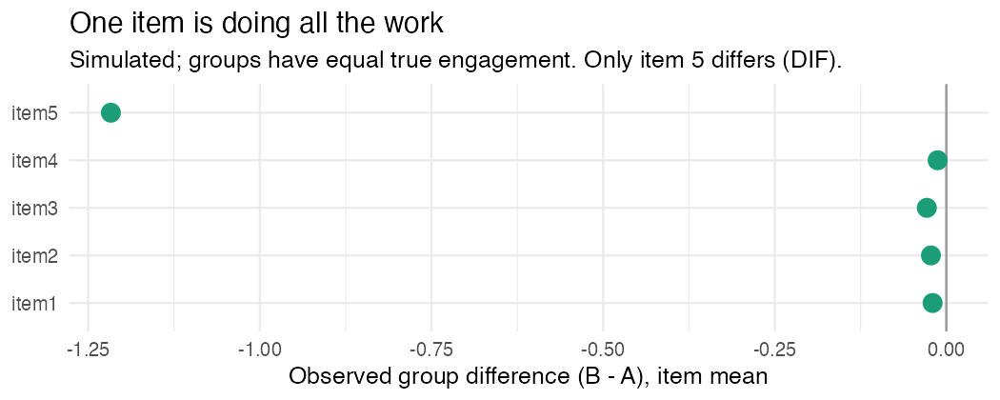

Here's a sentence that should make you flinch: "Group A scored higher on the
belonging scale, so Group A feels more like they belong."

I have a soft spot for this trap, mostly because I've walked into it myself. It
sounds airtight. Five items, two groups, one mean is higher, write it up. But
there's a premise buried in there that nobody says out loud, and the whole
conclusion is sitting on top of it.

The premise is that the scale *means the same thing* to both groups.

## The lens thing

I think of a scale as a lens you look at a construct through. Comparing two
groups' scores assumes they're looking through the *same* lens. If the lenses are
ground differently, then comparing what each group "sees" tells you about the
lenses, not the thing you were trying to look at. The technical name for "same
lens" is measurement invariance, and it is not a given. It's a thing you check.

## How much you're allowed to say

Invariance comes in levels, and each one buys you a different comparison. Roughly:
if the same items load on the same factor in both groups (configural), you've got
the basic shape. If the loadings are equal too (metric), you can start comparing
*relationships* across groups. And only if the intercepts are also equal (scalar)
are you actually allowed to compare means.

That last one is the level your group comparison quietly assumed it had. You test
for it with a multigroup CFA. And when a single item behaves differently across
groups, that's DIF, differential item functioning, which is a fancy way of saying
the lens has a chip in it right there.

## Watch it happen

Two groups, a 5-item engagement scale, and here's the thing: I built them to have
*identical* true engagement. Same distribution, no real difference. Then I made
one item (item 5) read systematically lower for group B at the same level of
engagement. Textbook DIF. Then I just... compared the groups, the way anyone
would, with a standardized mean difference:

```r
library(baselinr)
hedges_g(theta, group)        # the true latent difference
hedges_g(scale_full, group)   # observed, all 5 items
hedges_g(scale_inv, group)    # observed, dropping the one DIF item
```

| What's compared | Hedges' g |
|---|---:|
| True latent engagement | **−0.03** (there is no real difference) |
| Observed 5-item scale | **−0.25** |
| Scale without the DIF item | **−0.02** |



The groups are equal. I promise, I made them that way. And the full scale still
reports g = −0.25, which most people would write up as "Group B is less engaged."
The figure shows the crime scene: items 1 through 4 are flat, and item 5 is doing
*all* of the work, off by −1.22 on its own. Pull that one item and the difference
evaporates to −0.02.

Nothing about engagement happened here. The ruler happened.

## What to do

Test invariance before you compare means, every time you're comparing a latent
thing across groups. If it fails, don't throw the whole comparison out, go find
the items that broke (the DIF ones). And then report partial invariance honestly,
anchored on the items that held. It's less clean than a single triumphant
p value. It's also the difference between a finding about students and a finding
about your questionnaire.

---

*Measurement is the thing I get genuinely nerdy about. I build
[`baselinr`](https://github.com/zl1212-ship-it/baselinr) and I'm building a cohort
course on credible evaluation and measurement in education. [subscribe via RSS](https://zl1212-ship-it.github.io/education-methods/index.xml) if you want in.*
