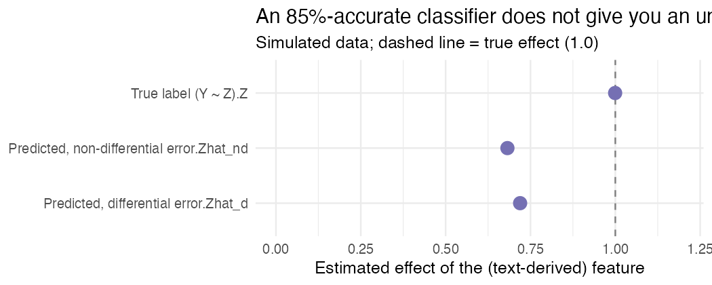

There's a very specific high that hits when a classifier you've been wrestling
with for days finally clears 85% on the held-out set. It works. You run it over
all fifty thousand comments, attach the predicted labels to your dataset, and
move on to the analysis you actually cared about.

That's the exact moment I want to grab your arm.

Because the 15% it got wrong doesn't politely stay inside the classifier. It rides
along into the regression, and it changes your answer. "Accuracy" is hiding how
much.

## A predicted label is a guess you're treating as a fact

That's the whole problem in one sentence. You didn't *observe* "this feedback is
specific." You *estimated* it, with a model that's right most of the time and
wrong some of the time. The minute you drop those predictions into a regression as
if they were the real thing, you've imported the model's mistakes without telling
the regression they're there.

And the phrase "ground truth" makes it so much worse, because it's not ground
truth. It's the classifier's training target. In your actual analysis those labels
are a noisy stand-in, and calling them truth is how the error sneaks past you.

## What the error does depends on what kind it is

If the mistakes are just random (the classifier is equally clumsy everywhere), and
the noisy variable is a predictor, the effect gets **attenuated**. Pulled toward
zero. This is the part people get wrong in conversation, by the way. "It's just
noise, it averages out." A regression coefficient on a mismeasured predictor does
not average out. It shrinks.

Differential error is the one that actually scares me. If the classifier is worse
for some cases than others, in a way that's tied to your outcome or your groups,
the bias picks up a *direction*. You're not just underestimating anymore. You can
end up pointing the wrong way.

Your setup is the textbook case: you predict "feedback specificity" from teacher
comments, then relate it to student progress. Now suppose the model reads feedback
from teachers of multilingual learners a little worse. That error is now braided
into exactly the comparison you care about, and it doesn't wash out. It bends the
conclusion.

## Watch it happen

Six thousand simulated comments. The true effect of the text feature on the
outcome is 1.0. I feed two classifiers' *predicted* labels into the same
regression and treat them as truth:

```r
# True effect of Z on Y is 1.0 (simulated).
coef(lm(Y ~ Z))["Z"]         # if we had the true labels
coef(lm(Y ~ Zhat_nd))        # 85% accurate, error unrelated to anything
coef(lm(Y ~ Zhat_d))         # 85% accurate overall, but worse for one group
```

| Labels used | Estimated effect |
|---|---:|
| True labels | **1.00** |
| Predicted — non-differential error | **0.68** |
| Predicted — differential error | **0.72** |



Sit with two things here. First: clean, random, 85%-accurate error drags a true
effect of 1.0 down to 0.68. A third of your signal, gone, purely from treating
guesses as data. Second, and this is the one that gets me: both classifiers report
the *same* 85%. But the "differential" one is 93% accurate for one group and 78%
for the other. The headline number cannot tell you which world you're in. Only
breaking accuracy out by subgroup can.

## What to actually do

Keep a human-labeled gold set, and not just for tuning. You need it to *measure*
the error so you can correct for it later. Report classifier performance broken
out by the groups you'll compare, because "85% overall" is precisely where
differential error hides. And then either propagate that uncertainty into the
analysis or use an estimator built for predicted labels (there's a small but
real literature on inference with machine-predicted variables now). Whatever you
do, stop quietly swapping predictions in for observations and calling it done.

Measure your measurement. Report it by group. Let the error into the model the
same way it's already, invisibly, in your data.

---

*This exact corner, where text models meet measurement error, is what I work on. I
build [`baselinr`](https://github.com/zl1212-ship-it/baselinr) and I'm putting
together a cohort course on credible evaluation and measurement in education.
[subscribe via RSS](https://zl1212-ship-it.github.io/education-methods/index.xml) if you want to follow along.*
