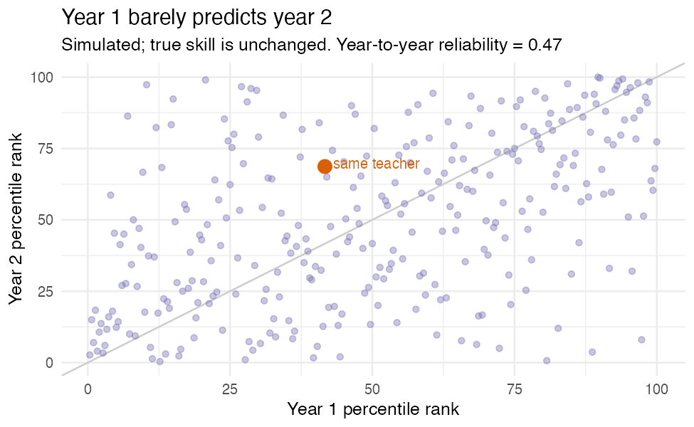

Somewhere right now a teacher is being handed a number that says she went from the
40th percentile to the 70th in a single year, and a district is quietly deciding
what that number says about her. Maybe a bonus. Maybe a "see, the system works."

I want to talk about how little that number might actually be saying, because the
people on the other end of it don't get to see the error bars.

## What it's trying to do

A value added model starts from a fair idea. Predict each kid's score from where
they started and a few covariates, and credit the teacher with the part that beat
the prediction. Net out the head start, reward the gain. I don't think the goal is
wrong.

The problem is that the teacher's real contribution is *small* next to everything
else shoving those scores around, and the one thing the model can't fully scrub
out is the biggest one: kids are not handed to teachers at random.

## What's actually inside the score

The number says "effectiveness," but it's carrying a lot of passengers. Some of it
is real teaching. Some of it is sorting, because if the stronger or better supported
kids keep landing with certain teachers, adjusting for prior scores shrinks that
bias but never kills it, and whatever you didn't measure rides straight through.
Some of it is test measurement error, which goes in one end and comes out the
other as "effectiveness." Some of it is just small samples, a teacher judged on one
or two classrooms, where a couple of unusual kids swing the whole thing. And some
of it is the test's scale.

Stack all of that up and the year to year stability of these scores tends to be
modest, well below what a high stakes ranking quietly assumes.

## Watch it happen

I gave 300 simulated teachers a fixed, unchanging true effectiveness. It does not
move. The only thing that changes between year one and year two is noise: small
classes, test error, the luck of the draw.

```r
vam1 <- mu + noise   # year 1 estimate
vam2 <- mu + noise   # year 2 estimate, same true mu, fresh noise
cor(vam1, vam2)      # year to year reliability
```

The year to year reliability comes out at **0.47**. Of the teachers in the bottom
quartile one year, **23% land above the median the next**, same people, same
skill. And a representative teacher slides from the **42nd to the 69th percentile**
between years without changing a thing.



That jump from the low 40s to the high 60s, the one a district would frame as a
turnaround? Pure noise. The scatter says it flatly: where a teacher ranks one year
barely tells you where they'll rank the next.

## And then it gets worse

Once a number carries stakes, Campbell's Law shows up: the moment a metric becomes
a target, people optimize the metric instead of the thing it was supposed to stand
for. Teaching to the test. Quietly steering which kids end up in your room.
Narrowing what gets taught. The score stops being even the noisy proxy it started
as.

## What to do

If you're going to use these at all: report the uncertainty, and actually look at
how wide it is. Shrink the estimates (empirical Bayes pulls noisy small sample
numbers toward the average, which is exactly right when most of the spread is
noise). Never hang a high stakes decision on a single year. And say out loud what
you're assuming about how kids got sorted to teachers, because the entire causal
story rests on it.

These scores can inform. Used as a one number verdict on someone's career, they
mostly measure which children walked through the door.

---

*This is where methods and policy collide, which is the part of this work I care
about most. I build [`baselinr`](https://github.com/zl1212-ship-it/baselinr) and a
cohort course on credible evaluation and measurement in education. [subscribe via RSS](https://zl1212-ship-it.github.io/education-methods/index.xml) to follow along.*
